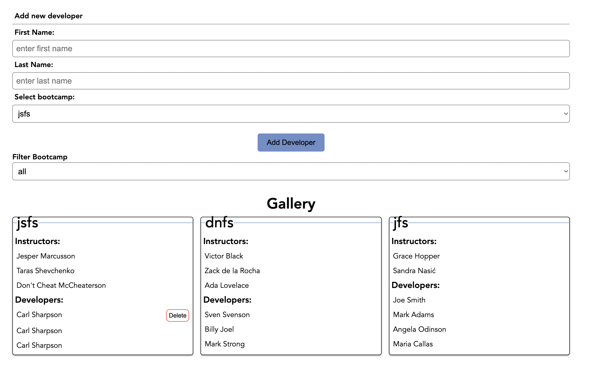

# Salt test

## React - Salt Instructors & Developers

Us instructors have so much todo so we need help keeping track on all developers. Your task is to create a simple UI for us to add, remove developer in different bootcamps and filter by bootcamp.

We have supplied you with a backend, so this is a frontend test only. You need to follow the specifications as detailed below. Use the screenshot at the bottom of this page as a wireframe.

This weekend test has a very long list of specifications which might make it seem larger than it actually is. Focus on completing one specification at a time. Let both the tests &

We recommend that your first command is:

`npx create-react-app frontend`

The server for this weekend test has already been written and you do not need to make any changes there. Starting the server you have to cd the `server` - folder and run `npm i && npm start`. The server runs on port 3001 and the client should run on port 3000. Check the routes in the server to find out which endpoints you have to use in order for you to do your `GET`, `POST` and `DELETE` requests. We recommend you playing around with the api through e.g. Postman. Changes in your UI MUST be reflected in the API.

Take care reading the UI and Technical specifications below as they are in a different format to before, they follow the [RFC2119]
(<https://www.ietf.org/rfc/rfc2119.txt>) specification.

> Google for inspiration, read other developers code but make sure to not copy-paste solutions as that would be considered cheating.

### UI specifications

- There MUST be a gallery that displays bootcamp cards.
  -There MUST be bootcamp cards for each bootcamp.
- Each bootcamp card MUST display the name of the course, list of instructors & a seperate list of developers.
- There MUST be two inputs in the form where the user can add a first name and a last name of a new developer.
- There MUST be a selection in the form where the user can choose which bootcamp to add the developer to.
  - bootcamps:
    - jsfs
    - jfs
    - dnfs
- When the user submits a new developer from the form the developer MUST appear in the list of developers in the correct bootcamp card without a page reload.
- There MUST be a selections list that filters what bootcamp card is being rendered. The selection list MUST have options:
  - all
  - jsfs
  - jfs
  - dnfs
- Each developer item MUST be toggleable and when the user clicks the developer item a delete button MUST appear. When the user clicks this button the item MUST be deleted instantly from the list without reloading the page.
- The different bootcamp cards SHOULD be easy to visually separate.
- The instructors list and the developers list SHOULD be easy to visually separate.
- It MUST be easy to add, toggle and remove developers. For example adding a new developer by hitting the 'Enter'-button
- An error message MUST be displayed to the user if the user tries to add a developer with invalid input values, according to the e2e test.

### Technical specifications

- You MUST keep the fetched data in a state object and you SHOULD fetch the data on initial mount. You MUST not store the data in localStorage.
- You MUST use functional components.
- You MUST use at least 4 levels of components.
- You MUST use `props` for passing the necessary information between components. You MUST NOT use React Router, useContext nor Redux.
- You MUST use Semantic html elements.
- You MUST use a clear naming strategy for your css and class names.
- You SHOULD have a mobile first approach.
- You SHOULD have suitable tests - we will run your tests, and expect no errors. Make sure that the tests you write pass.
- You MUST reuse the same component for both instructor & developer items

#### Tech specification for test correction

We will run a separate end-to-end-test suite (e2e test) that automate correcting your tests. In order for our automated correction to run properly you will need to use the classes and ids in the list below.

Here is what our e2e-tests will check:

- to add a new developer we will type in two input fields with class names `addDeveloperFirstNameInput` and class `addDeveloperLastNameInput` then click an element with class `btnAddDeveloper`.
- to see if a developer has been added we will compare the number of children in an element with class `cardList` before and after.
- to see how many bootcamp cards are being rendered we will look for an element with class `gallery` and count the elements with class `bootcamp` when the filter selection value shows all the bootcamps.
- we will check how many bootcamp cards are being rendered when targeting a selection element with class `selectBootcamp`. When you filter by a bootcamp the number of elements with class `cardList` must be 2.

- we will click a developer item with a class `card`.
- we will look for a button with class `deleteBtn` inside a card with class `toggled`.
- we will look for an element with class `errorMessage` if input values are invalid. If you use a set timeout, make sure to display the message for a min of 1000 ms.

### Running e2e tests

In this repository there's a `e2e`-folder that contains e2e-test using [Cypress.IO](http://cypress.io). This should be run separately from your application (your solution). You DO NOT need to copy this into the created react application.

1. Start your `server` and your `frontend`-application and ensure that your client is running on `http://localhost:3000`
2. Run the e2e tests, in a separate terminal window, don't forget to`npm i` before running the tests

   ```bash
   cd e2e
   npm t
   ```

We have supplied a single e2e test that adds a developer to the `jsfs` list. You can (and should) add more tests to ensure that your application works according to the requirements. Use our test as a guide.

When correcting your test our test suite will contain more tests than the one that we have supplied.

### Handing in

- Check that you have no console errors.
- Make sure it runs from a clean `npm i && npm start` in both the `server` and the `frontend` folder.
- Hand in the content of your `frontend` folder (except for the node_modules) in a folder named `saltBootcamp` in your weekend test folder.

Make it work, and then if you have time, make it great!

|  |
| :-------------------------: |
| Example of this application |

## FAQ

Can we ignore Internet Explorer?

> Yes, you do not have to consider compatibility with Internet Explorer.

Can we use axios?

> Yes, use any library that you want.

Can we use localStorage?

> No.

I'm so stuck, and I don't know how to get started!

> Take a break, you have all the information and skills you need to solve this. Go through lecture slides and previous labs. Think of these three questions: 1. What is the apps component structure? 2. What components should include logic? 3. What state is only local and what state/setters do I have to prop drill?

How will you judge our solutions?

> We are going to judge them based on functionality (50%, running an automated E2E-test suite, be careful using the correct classes above), and a code review where we confirm that the technical specification has been followed (50%). We will not judge the design.
